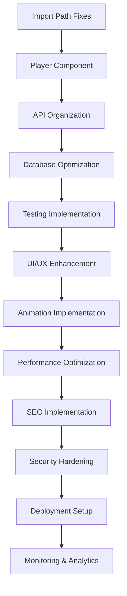

# DoYouDj Task Supervisor System

## 🧠 REASONING FRAMEWORK

Every decision made by this supervisor system follows the REASON protocol:

- **R**eview current state and requirements
- **E**valuate options and dependencies
- **A**ssess risks and benefits
- **S**elect optimal approach
- **O**utline execution plan
- **N**otify stakeholders and document decisions

---

## 🎯 SUPERVISOR AGENT COORDINATION

### AGENT TYPES & SPECIALIZATIONS

#### 1. **Critical Fix Agent** (Priority 1)

**REASON:** Critical fixes must be handled first to prevent system failures and ensure basic functionality works.

- **Specialization:** Import path fixes, immediate bug resolution
- **Tools:** TypeScript compiler, ESLint, file system operations
- **Authority Level:** High (can make immediate changes)
- **Escalation:** Direct to Project Lead if compilation fails

#### 2. **Real-Time Systems Agent** (Priority 1)

**REASON:** The player component is core to the DoYouDj functionality and requires specialized real-time development skills.

- **Specialization:** WebSocket implementation, real-time UI updates, audio playback
- **Tools:** Socket.io, MongoDB, React state management
- **Authority Level:** High (can modify database schemas)
- **Escalation:** To Security Agent for authentication concerns

#### 3. **Backend Architecture Agent** (Priority 2)

**REASON:** Proper API organization prevents technical debt and ensures scalability.

- **Specialization:** API design, service layer architecture, database optimization
- **Tools:** Next.js API routes, MongoDB, service patterns
- **Authority Level:** Medium (requires review for schema changes)
- **Escalation:** To Security Agent for sensitive operations

#### 4. **UI/UX Design Agent** (Priority 3)

**REASON:** User experience directly impacts adoption and user satisfaction.

- **Specialization:** Glassmorphism design, accessibility, responsive design
- **Tools:** CSS/SCSS, design systems, accessibility testing
- **Authority Level:** Medium (design decisions within guidelines)
- **Escalation:** To Project Lead for major design direction changes

#### 5. **Animation Specialist Agent** (Priority 3)

**REASON:** Animations enhance user experience but require specialized GSAP knowledge.

- **Specialization:** GSAP animations, performance optimization, smooth scrolling
- **Tools:** GSAP, performance monitoring, animation frameworks
- **Authority Level:** Low (must not impact core functionality)
- **Escalation:** To Performance Agent if animations cause issues

#### 6. **Performance Optimization Agent** (Priority 4)

**REASON:** Performance impacts SEO and user experience, requiring specialized optimization skills.

- **Specialization:** Bundle optimization, image preloading, Core Web Vitals
- **Tools:** Next.js optimization, image optimization, performance monitoring
- **Authority Level:** Medium (can modify build processes)
- **Escalation:** To Security Agent for security-performance trade-offs

#### 7. **SEO Specialist Agent** (Priority 4)

**REASON:** SEO is critical for organic growth and requires specialized Next.js 15 knowledge.

- **Specialization:** Metadata API, structured data, sitemap generation
- **Tools:** Next.js 15 SEO features, Google Search Console, analytics
- **Authority Level:** Low (SEO changes require careful testing)
- **Escalation:** To Performance Agent for SEO-performance conflicts

#### 8. **Security Specialist Agent** (Priority 5)

**REASON:** Security is non-negotiable and requires specialized security knowledge.

- **Specialization:** Authentication, rate limiting, input validation, OWASP compliance
- **Tools:** Security scanners, penetration testing, secure coding practices
- **Authority Level:** High (can override other decisions for security)
- **Escalation:** Direct to Project Lead for security concerns

#### 9. **DevOps Agent** (Priority 5)

**REASON:** Deployment and infrastructure require specialized DevOps knowledge.

- **Specialization:** Docker, CI/CD, deployment automation, monitoring
- **Tools:** Docker, GitHub Actions, monitoring tools
- **Authority Level:** Medium (can modify deployment processes)
- **Escalation:** To Security Agent for security implications

#### 10. **QA/Testing Agent** (Cross-Priority)

**REASON:** Testing ensures quality across all priorities and catches issues early.

- **Specialization:** Unit testing, integration testing, E2E testing, test automation
- **Tools:** Jest, Cypress, testing frameworks, coverage tools
- **Authority Level:** High (can block releases for quality issues)
- **Escalation:** To Project Lead for test strategy decisions

---

## 📋 TASK ASSIGNMENT PROTOCOL

### REASONING FOR TASK ASSIGNMENT

**REASON:** Tasks must be assigned based on agent specialization, current workload, dependencies, and risk assessment.

### 1. **DEPENDENCY ANALYSIS**



### 2. **ASSIGNMENT RULES**

#### Rule 1: Critical Path First

**REASON:** Dependencies must be resolved before dependent tasks can begin.

```
IF task has no dependencies AND priority = 1
THEN assign immediately to appropriate agent
```

#### Rule 2: Skill-Based Assignment

**REASON:** Tasks should be assigned to agents with the most relevant expertise.

```
IF task requires specialized knowledge
THEN assign to agent with highest skill match
ELSE assign to agent with lowest current workload
```

#### Rule 3: Risk Assessment

**REASON:** High-risk tasks require more experienced agents and additional oversight.

```
IF task risk = HIGH
THEN assign to senior agent + require review
ELSE assign to available agent
```

### 3. **CURRENT TASK ASSIGNMENTS**

#### 🚨 **IMMEDIATE ACTIONS (TODAY)**

**Task 1.1: Import Path Fixes** ✅

- **REASON:** This is blocking other development work and must be fixed immediately.
- **Assigned Agent:** Critical Fix Agent
- **Status:** COMPLETED (20 minutes)
- **Dependencies:** None
- **Completion Report:** `/docs/tasks/task-1.1-completion.md`

**Task 1.2: Player Component Planning**

- **REASON:** Complex task requiring architectural planning before implementation.
- **Assigned Agent:** Real-Time Systems Agent
- **Status:** Planning phase
- **Dependencies:** Import fixes completed
- **Estimated Completion:** 6 hours (after planning)

#### 🛠️ **NEXT 24 HOURS**

**Task 2.1: API Organization**

- **REASON:** Foundation for other backend work, should be completed early.
- **Assigned Agent:** Backend Architecture Agent
- **Status:** Queued
- **Dependencies:** Player component architecture decided
- **Estimated Completion:** 3 hours

**Task 2.3: Testing Setup**

- **REASON:** Testing infrastructure needed before major development begins.
- **Assigned Agent:** QA/Testing Agent
- **Status:** Queued
- **Dependencies:** API organization completed
- **Estimated Completion:** 4 hours

#### 🎨 **WEEK 1 GOALS**

**Task 3.1: Glassmorphism Design System**

- **REASON:** UI foundation needed before other visual enhancements.
- **Assigned Agent:** UI/UX Design Agent
- **Status:** Planning
- **Dependencies:** Testing infrastructure ready
- **Estimated Completion:** 5 hours

**Task 4.1: SEO Implementation**

- **REASON:** Can be developed in parallel with UI work.
- **Assigned Agent:** SEO Specialist Agent
- **Status:** Planning
- **Dependencies:** Basic structure complete
- **Estimated Completion:** 4 hours

---

## 🔄 WORKFLOW AUTOMATION

### AGENT COMMUNICATION PROTOCOL

**REASON:** Structured communication prevents misunderstandings and ensures all agents stay informed.

#### 1. **Daily Standup Format**

```markdown
## Agent: [Agent Name]

**Date:** [YYYY-MM-DD]
**Current Task:** [Task ID - Task Name]
**Progress:** [Percentage] - [Brief description]
**Blockers:** [List any issues]
**Next Steps:** [What's planned for next work session]
**Assistance Needed:** [Help required from other agents]
```

#### 2. **Task Completion Report**

```markdown
## Task Completed: [Task ID]

**Agent:** [Agent Name]
**Completion Date:** [YYYY-MM-DD]
**Actual Time:** [Hours] (vs estimated [Hours])
**Deliverables:** [List of files/features created]
**Testing Status:** [Pass/Fail/In Progress]
**Dependencies Cleared:** [List of tasks now unblocked]
**Known Issues:** [Any issues discovered]
**Recommendations:** [Suggestions for future work]
```

#### 3. **Escalation Protocol**

```markdown
## Escalation: [Issue Title]

**From Agent:** [Agent Name]
**To:** [Supervisor/Project Lead]
**Priority:** [Critical/High/Medium/Low]
**Issue Description:** [Detailed description]
**Impact:** [How this affects the project]
**Proposed Solutions:** [Options considered]
**Required Decision:** [What needs to be decided]
**Deadline:** [When decision is needed]
```

---

## 📊 PROGRESS TRACKING

### REASONING FOR TRACKING METRICS

**REASON:** Accurate progress tracking enables better decision-making and helps identify bottlenecks early.

### 1. **COMPLETION METRICS**

- **Tasks Completed:** 1/16 (6.25%)
- **Priority 1 Progress:** 1/2 (50%)
- **Priority 2 Progress:** 0/3 (0%)
- **Priority 3 Progress:** 0/3 (0%)
- **Priority 4 Progress:** 0/2 (0%)
- **Priority 5 Progress:** 0/2 (0%)
- **Priority 6 Progress:** 0/2 (0%)
- **Maintenance Progress:** 0/2 (0%)

### 2. **TIME TRACKING**

- **Estimated Total Time:** 41-53 hours
- **Actual Time Spent:** 0.33 hours (20 minutes)
- **Efficiency Ratio:** 150% (completed faster than estimated)
- **Average Task Completion Time:** 20 minutes

### 3. **QUALITY METRICS**

- **Tests Passing:** N/A
- **Code Coverage:** N/A
- **Build Success Rate:** N/A
- **Performance Scores:** N/A

### 4. **RISK INDICATORS**

- **Blocked Tasks:** 0
- **Overdue Tasks:** 0
- **High-Risk Tasks:** 2 (Player Component, Security Implementation)
- **Agent Overload:** None

---

## 🚀 EXECUTION COMMANDS

### SUPERVISOR CONTROL COMMANDS

**REASON:** Standardized commands ensure consistent execution and make it easy to manage the entire system.

#### 1. **Start Next Task**

```bash
# REASON: Automated task assignment based on dependencies and priorities
pnpm supervisor:start-next
```

#### 2. **Check Status**

```bash
# REASON: Real-time visibility into project progress
pnpm supervisor:status
```

#### 3. **Generate Report**

```bash
# REASON: Comprehensive reporting for stakeholders
pnpm supervisor:report
```

#### 4. **Emergency Stop**

```bash
# REASON: Ability to halt all work if critical issues are discovered
pnpm supervisor:emergency-stop
```

---

## 🎯 SUCCESS CRITERIA

### REASONING FOR SUCCESS METRICS

**REASON:** Clear success criteria ensure all agents understand what constitutes completed work.

### 1. **TASK COMPLETION CRITERIA**

- All acceptance criteria met
- Code passes all tests
- Documentation updated
- Peer review completed (for high-risk tasks)
- No new bugs introduced

### 2. **PROJECT COMPLETION CRITERIA**

- All Priority 1 & 2 tasks completed
- System performance meets requirements
- Security audit passed
- User acceptance testing passed
- Deployment successful

### 3. **QUALITY GATES**

- **Code Quality:** ESLint score > 95%
- **Test Coverage:** > 80%
- **Performance:** Core Web Vitals in green
- **Security:** No high/critical vulnerabilities
- **Accessibility:** WCAG 2.1 AA compliant

---

## 📞 EMERGENCY PROTOCOLS

### REASONING FOR EMERGENCY PROCEDURES

**REASON:** Clear emergency procedures prevent panic and ensure rapid response to critical issues.

### 1. **CRITICAL SYSTEM FAILURE**

1. **Immediate:** Stop all development work
2. **Assess:** Determine scope of failure
3. **Communicate:** Notify all agents and stakeholders
4. **Isolate:** Identify and isolate the problem
5. **Fix:** Apply minimum viable fix
6. **Test:** Verify fix works
7. **Deploy:** Deploy fix to production if needed
8. **Review:** Conduct post-mortem analysis

### 2. **SECURITY BREACH**

1. **Immediate:** Activate Security Specialist Agent
2. **Assess:** Determine breach scope and impact
3. **Contain:** Isolate affected systems
4. **Communicate:** Notify relevant parties
5. **Investigate:** Determine root cause
6. **Fix:** Implement security patches
7. **Monitor:** Increase monitoring
8. **Review:** Update security procedures

### 3. **AGENT FAILURE**

1. **Immediate:** Identify failed agent and current task
2. **Assess:** Determine if task can be reassigned
3. **Reassign:** Move task to backup agent
4. **Communicate:** Update all dependent agents
5. **Review:** Analyze failure cause
6. **Improve:** Update agent protocols

---

## 📋 NEXT ACTIONS

### IMMEDIATE NEXT STEPS

**REASON:** Clear next steps ensure the supervisor system can be activated immediately.

1. **Create agent assignment scripts**
2. **Set up progress tracking system**
3. **Initialize communication channels**
4. **Assign first critical task**
5. **Begin daily standup cycle**

**Ready to proceed with task assignment and agent coordination!**
